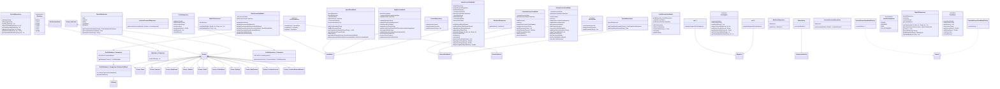

```mermaid
classDiagram
    class ActivityRepository {
        +addLog(Activity)
        +deleteLog(Activity)
        +getAllLogs(String) List<Int>
        +adjustTimesWalked(String, Int, Int)
        +getTotalTimesWalked(String) Int
        +addNotesToLog(String, Int, String)
        +getNotesForHike(String, Int) String
        +getTimesWalkedForHike(String, Int) Int
    }

    class HikeScreenViewModel {
        -_hikeScreenUIState
        +hikeScreenUIState StateFlow<HikeScreenUIState>
        +updateHike(Feature)
        +updateRecommendedHikes(List<Feature>)
        +updateRecommendedHikesLoaded(Boolean)
        +getHikeDescription(HomeScreenViewModel, OpenAIViewModel)
        +updateDescriptionAlreadyLoaded(Boolean)
        +updateSelectedDay(String)
        +updateSelectedDate(String)
    }

    class HikeScreenUIState {
    }

    class FavoritesScreenViewModel {
        -_favoriteScreenUIState
        +favoriteScreenUIState StateFlow<FavoriteScreenUIState>
        +loadFavorites()
        +setUser()
        +updateUserLocationFromMapbox()
        +updateUserLocation(Point)
        +getAllFavorites(String) List<Int>
        +isHikeFavorite(Feature) Boolean
        +getAllConverteFavorites()
        +addFavorite(Int)
        +deleteFavorite(Int)
    }

    class OpenAIDatasource {
        -client
        -endpoint
        -apiKey
        -modelName
        -apiVersion
        +getCompletionsSamples(String) ChatCompletionsResponse
        +getCompletionsStream(String) Flow<String>
        -processJsonLine(String) String?
    }

    class LocationForecastDatasource {
        +getLocationForecast(Double, Double) Locationforecast?
    }

    class ProfileDatabase_Companion_DatabaseCallBack {
+onCreate(SupportSQLiteDatabase)
-populateDatabase()
}

class ProfileDatabase_Companion {
-INSTANCE ProfileDatabase?
+getDatabase(Context) ProfileDatabase
}

class ProfileDatabase {
<<abstract>>
+favoriteDao() FavoriteDao
+profileDao() ProfileDao
+logDao() ActivityDao
}

class HikeAPIDatasource {
-ktorHttpClient
+getHikes(Double, Double, Int, String, Int) List<Feature>
+getHikesById(List<String>, Point) List<Feature>
}

class null_1 {
+migrate(SupportSQLiteDatabase)
}

class null_2 {
+migrate(SupportSQLiteDatabase)
}

class OpenAIViewModel {
-openAIRepository
-hikeAPIRepository
-_openAIUIState
+openAIUIState StateFlow<OpenAIUIState>
-_conversationHistory
+conversationHistory List<ChatbotMessage>
+addUserMessage(String)
+addBotMessage(String)
+getCompletionsSamples(String, (String) -> Unit)
+getCompletionsStream(String)
+addFeature()
+getChatbotResponse(String, HomeScreenViewModel)
+getRecommendedHikes(HomeScreenViewModel, HikeScreenViewModel)
}

class Weekdays_Companion {
+indexOf(String) Int
}

class Weekdays {
<<enumeration>>
Mandag
Tirsdag
Onsdag
Torsdag
Fredag
Lørdag
Søndag
}

class FavoriteRepository {
+addFavorite(Favorite)
+deleteFavorite(Favorite)
+getAllFavorites(String) List<Int>
}

class MapboxViewModel {
-placeAutocomplete
-_mapboxUIState MutableStateFlow<MapboxUIState>
+mapboxUIState StateFlow<MapboxUIState>
+updateMapStyle(String)
+updatePointerCoordinates(Point?)
+resetShouldFetchHikes()
+updateSearchQuery(String)
+getSelectedSearchResultPoint(PlaceAutocompleteSuggestion)
+setLoaderState(Boolean)
+updatePolylineAnnotationsFromFeatures(List<Feature>)
+clearPolylineAnnotations()
+centerOnUserPosition()
+updateLatestUserPosition(Point)
}

class MetAlertsDatasource {
+getMetAlerts() MetAlerts?
}

class HomeScreenViewModel {
-hikeAPIRepository
-locationForecastRepository
-metAlertsRepository
-_homeScreenUIState
+homeScreenUIState StateFlow<HomeScreenUIState>
-_sheetStateTarget
+sheetStateTarget
-_currentSheetOffset
+currentSheetOffset
+markAanundDialogShown()
+setSheetState(SheetDrawerDetent)
+updateNetworkStatus(Boolean)
+updateSheetOffset(Float)
+fetchHikes(Double, Double, Int, String, Int)
+fetchForecast(Point)
+fetchAlerts()
+clearHikes()
+timeSeriesFromDate(String) List<TimeSeries>?
+daysHighestTemp(String) Double
+daysLowestTemp(String) Double
+daysAverageWindSpeed(String) Double
}

class Screen_Welcome { 
 }

class Screen_Home { 
 }

class Screen_Favorites { 
 }

class Screen_HikeScreen { 
 }

class Screen_Chatbot { 
 }

class Screen_Profile { 
 }

class Screen_ProfileSelect { 
 }

class Screen_Settings { 
 }

class Screen_MapPreview { 
 }

class Screen_LocationForecast { 
 }

class Screen_LocationForecastDetailed { 
 }

class Screen { 
 }

class FavoriteDao {
<<interface>>
+saveFavorite(Favorite)
+deleteFavorite(Favorite)
+getAllFavorites(String) List<Int>
}

class OpenAIRepository {
-openAIDatasource
+getCompletionsSamples(String) ChatCompletionsResponse
+getCompletionsStream(String) Flow<String>
 }

class ActivityScreenViewModel {
-_activityScreenUIState
+activityScreenUIState StateFlow<ActivityScreenUIState>
+loadActivities()
+setUser()
+updateUserLocationFromMapbox()
+updateUserLocation(Point)
+getConvertedActivities()
+addToActivityLog(Int)
+removeFromActivityLog(Int)
+addNotesToActivityLog(Int, String)
+adjustTimesWalked(Int, Int)
+getNotesForHike(Int)
+getTotalTimesWalked()
+getTimesWalkedForHike(Int)
+calculateTotalDistance()
}

class MainActivity {
+onCreate(Bundle?)
}

class ActivityDao {
<<interface>>
+saveLog(Activity)
+deleteLog(Activity)
+getAllLogs(String) List<Int>
+adjustTimesWalked(String, Int, Int)
+addNotesToLog(String, Int, String)
+getNotesForHike(String, Int) String
+getTotalTimesWalked(String) Int
+getTimesWalkedForHike(String, Int) Int
}

class ActivityScreenViewModelFactory {
+create(Class<T>) T
 }

class MetAlertsRepository {
-datasource
+getAlerts() MetAlerts?
}

class FavoritesScreenViewModelFactory {
+create(Class<T>) T
 }

class LocationForecastRepository {
-datasource
+getForecast(Double, Double) Locationforecast?
}

class ProfileScreenViewModel {
-profileRepository ProfileRepository
-_profileScreenUIState
+profileScreenUIState StateFlow<ProfileScreenUIState>
+addProfile(String)
+deleteProfile(String)
+selectProfile(String, () -> Unit)
+setProfile()
+getAllProfiles()
}

class SheetDrawerDetent {
<<enumeration>>
HIDDEN
SEMIPEEK
PEEK
FULLYEXPANDED
}

class HikeAPIRepository {
-hikeAPIDatasource
-colorIndex
-coroutineScope
-generatedNames
+getHikes(Double, Double, Int, String, Int) List<Feature>
-generateAndSaveName(Feature, OpenAIViewModel)
-getColor() Color
-generateDifficulty(Feature)
-getDifficultyInfo(String) DifficultyInfo
+getHikesById(List<Int>, Point) List<Feature>
}

class ProfileDao {
<<interface>>
+insertUser(Profile)
+deleteUser(Profile)
+getAllUsers() List<Profile>
+selectUser(String)
+getSelectedUser() Profile?
+getDefaultUser() Profile?
+unselectUser()
+clearAllUsers()
}

class ProfileRepository_Companion {
-INSTANCE ProfileRepository?
+getInstance(Context, CoroutineScope) ProfileRepository
}

class ProfileRepository {
+addUser(Profile)
+deleteProfile(Profile)
+selectProfile(String)
+unselectUser()
+getSelectedUser() Profile
+getAllUsers() List<Profile>
+clearAllUsers()
}

HikeScreenViewModel --|> ViewModel
FavoritesScreenViewModel --|> AndroidViewModel
ProfileDatabase_Companion --> ProfileDatabase_Companion_DatabaseCallBack
ProfileDatabase_Companion_DatabaseCallBack --|> Callback
ProfileDatabase --> ProfileDatabase_Companion
ProfileDatabase --|> RoomDatabase
null_1 --|> Migration
null_2 --|> Migration
OpenAIViewModel --|> ViewModel
Weekdays --> Weekdays_Companion
MapboxViewModel --|> ViewModel
HomeScreenViewModel --|> ViewModel
Screen --> Screen_Welcome
Screen_Welcome --|> Screen
Screen --> Screen_Home
Screen_Home --|> Screen
Screen --> Screen_Favorites
Screen_Favorites --|> Screen
Screen --> Screen_HikeScreen
Screen_HikeScreen --|> Screen
Screen --> Screen_Chatbot
Screen_Chatbot --|> Screen
Screen --> Screen_Profile
Screen_Profile --|> Screen
Screen --> Screen_ProfileSelect
Screen_ProfileSelect --|> Screen
Screen --> Screen_Settings
Screen_Settings --|> Screen
Screen --> Screen_MapPreview
Screen_MapPreview --|> Screen
Screen --> Screen_LocationForecast
Screen_LocationForecast --|> Screen
Screen --> Screen_LocationForecastDetailed
Screen_LocationForecastDetailed --|> Screen
ActivityScreenViewModel --|> AndroidViewModel
MainActivity --|> ComponentActivity
ActivityScreenViewModelFactory ..|> Factory
FavoritesScreenViewModelFactory ..|> Factory
ProfileScreenViewModel --|> AndroidViewModel
ProfileRepository --> ProfileRepository_Companion
```