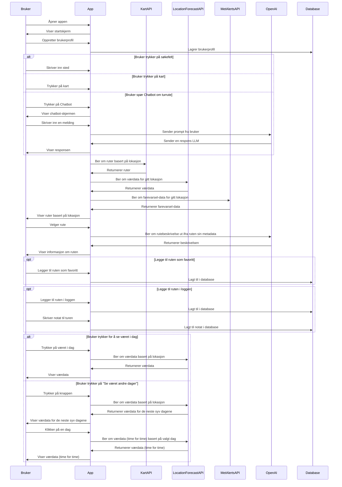
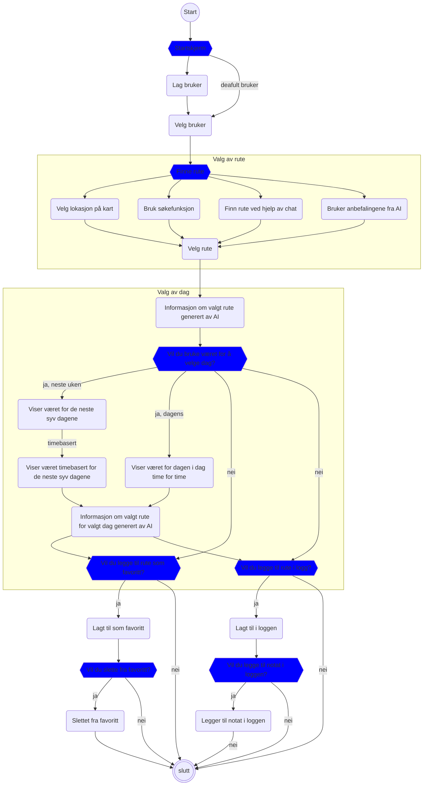

# Diagrammer
## Use case-diagram
Et use case-diagram viser et brukstilfelle, altså hvordan en aktør målrettet samhandler med systemet. Et use case har et større fokus på hvordan systemet fungerer, og dets funksjoner. Vi ønsker å bruke et use case-diagram for å vise hvordan en bruker kan interagere med applikasjonen vår. Det er en enkel og oversiktlig måte å vise funksjonalitet fra en brukers perspektiv, uten mengder med tekniske detaljer.
Diagrammet under illustrerer...

*bilde*

### Tekstlig beskrivelse av use case

## Sekvensdiagram
Et sekvensdiagram brukes for å illustrere hvordan objekter og/eller aktører interagerer med hverandre når brukeren utfører en spesifikk handling, for eksempel velge en turrute. Vi ønsket å bruke dette for å enkelt vise rekkefølgen av handlingene som skjer i applikasjonen, og hvordan de ulike delene av systemet samhandler. Diagrammet under illustrerer samhandlingen mellom bruker, applikasjon, API-er og databasen. 

## Klassediagram
Et klassediagram brukes for å illustrere systemets struktur, altså klasser og deres tilhørende metoder og egenskaper, samt hvordan de er koblet sammen gjennom for eksempel arv. Vi ønsket å bruke dette diagrammet for å definere klassene og beskrive relasjoner og avhengigheter mellom dem, samt forbedre forståelsen vår av systemets arkitektur. Diagrammet under viser oversikten over de implementerte klassene i prosjektet. Det illustrerer arv mellom klasser (hvem arver fra hvem), instansvariabler og deres typer og metoder (funksjoner) som er definert i hver klasse, inkludert arvede metoder.

```mermaid
classDiagram
    class ActivityRepository {
        +addLog(Activity)
        +deleteLog(Activity)
        +getAllLogs(String) List<Int>
        +adjustTimesWalked(String, Int, Int)
        +getTotalTimesWalked(String) Int
        +addNotesToLog(String, Int, String)
        +getNotesForHike(String, Int) String
        +getTimesWalkedForHike(String, Int) Int
    }

    class HikeScreenViewModel {
        -_hikeScreenUIState
        +hikeScreenUIState StateFlow<HikeScreenUIState>
        +updateHike(Feature)
        +updateRecommendedHikes(List<Feature>)
        +updateRecommendedHikesLoaded(Boolean)
        +getHikeDescription(HomeScreenViewModel, OpenAIViewModel)
        +updateDescriptionAlreadyLoaded(Boolean)
        +updateSelectedDay(String)
        +updateSelectedDate(String)
    }

    class HikeScreenUIState {
    }

    class FavoritesScreenViewModel {
        -_favoriteScreenUIState
        +favoriteScreenUIState StateFlow<FavoriteScreenUIState>
        +loadFavorites()
        +setUser()
        +updateUserLocationFromMapbox()
        +updateUserLocation(Point)
        +getAllFavorites(String) List<Int>
        +isHikeFavorite(Feature) Boolean
        +getAllConverteFavorites()
        +addFavorite(Int)
        +deleteFavorite(Int)
    }

    class OpenAIDatasource {
        -client
        -endpoint
        -apiKey
        -modelName
        -apiVersion
        +getCompletionsSamples(String) ChatCompletionsResponse
        +getCompletionsStream(String) Flow<String>
        -processJsonLine(String) String?
    }

    class LocationForecastDatasource {
        +getLocationForecast(Double, Double) Locationforecast?
    }

    class ProfileDatabase_Companion_DatabaseCallBack {
        +onCreate(SupportSQLiteDatabase)
        -populateDatabase()
    }

    class ProfileDatabase_Companion {
        -INSTANCE ProfileDatabase?
        +getDatabase(Context) ProfileDatabase
    }

    class ProfileDatabase {
        <<abstract>>
        +favoriteDao() FavoriteDao
        +profileDao() ProfileDao
        +logDao() ActivityDao
    }

    class HikeAPIDatasource {
        -ktorHttpClient
        +getHikes(Double, Double, Int, String, Int) List<Feature>
        +getHikesById(List<String>, Point) List<Feature>
    }

    class null_1 {
        +migrate(SupportSQLiteDatabase)
    }

    class null_2 {
        +migrate(SupportSQLiteDatabase)
    }

    class OpenAIViewModel {
        -openAIRepository
        -hikeAPIRepository
        -_openAIUIState
        +openAIUIState StateFlow<OpenAIUIState>
        -_conversationHistory
        +conversationHistory List<ChatbotMessage>
        +addUserMessage(String)
        +addBotMessage(String)
        +getCompletionsSamples(String, (String) -> Unit)
        +getCompletionsStream(String)
        +addFeature()
        +getChatbotResponse(String, HomeScreenViewModel)
        +getRecommendedHikes(HomeScreenViewModel, HikeScreenViewModel)
    }

    class Weekdays_Companion {
        +indexOf(String) Int
    }

    class Weekdays {
        <<enumeration>>
        Mandag
        Tirsdag
        Onsdag
        Torsdag
        Fredag
        Lørdag
        Søndag
    }

    class FavoriteRepository {
        +addFavorite(Favorite)
        +deleteFavorite(Favorite)
        +getAllFavorites(String) List<Int>
    }

    class MapboxViewModel {
        -placeAutocomplete
        -_mapboxUIState MutableStateFlow<MapboxUIState>
        +mapboxUIState StateFlow<MapboxUIState>
        +updateMapStyle(String)
        +updatePointerCoordinates(Point?)
        +resetShouldFetchHikes()
        +updateSearchQuery(String)
        +getSelectedSearchResultPoint(PlaceAutocompleteSuggestion)
        +setLoaderState(Boolean)
        +updatePolylineAnnotationsFromFeatures(List<Feature>)
        +clearPolylineAnnotations()
        +centerOnUserPosition()
        +updateLatestUserPosition(Point)
    }

    class MetAlertsDatasource {
        +getMetAlerts() MetAlerts?
    }

    class HomeScreenViewModel {
        -hikeAPIRepository
        -locationForecastRepository
        -metAlertsRepository
        -_homeScreenUIState
        +homeScreenUIState StateFlow<HomeScreenUIState>
        -_sheetStateTarget
        +sheetStateTarget
        -_currentSheetOffset
        +currentSheetOffset
        +markAanundDialogShown()
        +setSheetState(SheetDrawerDetent)
        +updateNetworkStatus(Boolean)
        +updateSheetOffset(Float)
        +fetchHikes(Double, Double, Int, String, Int)
        +fetchForecast(Point)
        +fetchAlerts()
        +clearHikes()
        +timeSeriesFromDate(String) List<TimeSeries>?
        +daysHighestTemp(String) Double
        +daysLowestTemp(String) Double
        +daysAverageWindSpeed(String) Double
    }

    class Screen_Welcome {
    }

    class Screen_Home {
    }

    class Screen_Favorites {
    }

    class Screen_HikeScreen {
    }

    class Screen_Chatbot {
    }

    class Screen_Profile {
    }

    class Screen_ProfileSelect {
    }

    class Screen_Settings {
    }

    class Screen_MapPreview {
    }

    class Screen_LocationForecast {
    }

    class Screen_LocationForecastDetailed {
    }

    class Screen {
    }

    class FavoriteDao {
        <<interface>>
        +saveFavorite(Favorite)
        +deleteFavorite(Favorite)
        +getAllFavorites(String) List<Int>
    }

    class OpenAIRepository {
        -openAIDatasource
        +getCompletionsSamples(String) ChatCompletionsResponse
        +getCompletionsStream(String) Flow<String>
    }

    class ActivityScreenViewModel {
        -_activityScreenUIState
        +activityScreenUIState StateFlow<ActivityScreenUIState>
        +loadActivities()
        +setUser()
        +updateUserLocationFromMapbox()
        +updateUserLocation(Point)
        +getConvertedActivities()
        +addToActivityLog(Int)
        +removeFromActivityLog(Int)
        +addNotesToActivityLog(Int, String)
        +adjustTimesWalked(Int, Int)
        +getNotesForHike(Int)
        +getTotalTimesWalked()
        +getTimesWalkedForHike(Int)
        +calculateTotalDistance()
    }

    class MainActivity {
        +onCreate(Bundle?)
    }

    class ActivityDao {
        <<interface>>
        +saveLog(Activity)
        +deleteLog(Activity)
        +getAllLogs(String) List<Int>
        +adjustTimesWalked(String, Int, Int)
        +addNotesToLog(String, Int, String)
        +getNotesForHike(String, Int) String
        +getTotalTimesWalked(String) Int
        +getTimesWalkedForHike(String, Int) Int
    }

    class ActivityScreenViewModelFactory {
        +create(Class<T>) T
    }

    class MetAlertsRepository {
        -datasource
        +getAlerts() MetAlerts?
    }

    class FavoritesScreenViewModelFactory {
        +create(Class<T>) T
    }

    class LocationForecastRepository {
        -datasource
        +getForecast(Double, Double) Locationforecast?
    }

    class ProfileScreenViewModel {
        -profileRepository ProfileRepository
        -_profileScreenUIState
        +profileScreenUIState StateFlow<ProfileScreenUIState>
        +addProfile(String)
        +deleteProfile(String)
        +selectProfile(String, () -> Unit)
        +setProfile()
        +getAllProfiles()
    }

    class SheetDrawerDetent {
        <<enumeration>>
        HIDDEN
        SEMIPEEK
        PEEK
        FULLYEXPANDED
    }

    class HikeAPIRepository {
        -hikeAPIDatasource
        -colorIndex
        -coroutineScope
        -generatedNames
        +getHikes(Double, Double, Int, String, Int) List<Feature>
        -generateAndSaveName(Feature, OpenAIViewModel)
        -getColor() Color
        -generateDifficulty(Feature)
        -getDifficultyInfo(String) DifficultyInfo
        +getHikesById(List<Int>, Point) List<Feature>
    }

    class ProfileDao {
        <<interface>>
        +insertUser(Profile)
        +deleteUser(Profile)
        +getAllUsers() List<Profile>
        +selectUser(String)
        +getSelectedUser() Profile?
        +getDefaultUser() Profile?
        +unselectUser()
        +clearAllUsers()
    }

    class ProfileRepository_Companion {
        -INSTANCE ProfileRepository?
        +getInstance(Context, CoroutineScope) ProfileRepository
    }

    class ProfileRepository {
        +addUser(Profile)
        +deleteProfile(Profile)
        +selectProfile(String)
        +unselectUser()
        +getSelectedUser() Profile
        +getAllUsers() List<Profile>
        +clearAllUsers()
    }

    HikeScreenViewModel --|> ViewModel
    FavoritesScreenViewModel --|> AndroidViewModel
    ProfileDatabase_Companion --> ProfileDatabase_Companion_DatabaseCallBack
    ProfileDatabase_Companion_DatabaseCallBack --|> Callback
    ProfileDatabase --> ProfileDatabase_Companion
    ProfileDatabase --|> RoomDatabase
    null_1 --|> Migration
    null_2 --|> Migration
    OpenAIViewModel --|> ViewModel
    Weekdays --> Weekdays_Companion
    MapboxViewModel --|> ViewModel
    HomeScreenViewModel --|> ViewModel
    Screen --> Screen_Welcome
    Screen_Welcome --|> Screen
    Screen --> Screen_Home
    Screen_Home --|> Screen
    Screen --> Screen_Favorites
    Screen_Favorites --|> Screen
    Screen --> Screen_HikeScreen
    Screen_HikeScreen --|> Screen
    Screen --> Screen_Chatbot
    Screen_Chatbot --|> Screen
    Screen --> Screen_Profile
    Screen_Profile --|> Screen
    Screen --> Screen_ProfileSelect
    Screen_ProfileSelect --|> Screen
    Screen --> Screen_Settings
    Screen_Settings --|> Screen
    Screen --> Screen_MapPreview
    Screen_MapPreview --|> Screen
    Screen --> Screen_LocationForecast
    Screen_LocationForecast --|> Screen
    Screen --> Screen_LocationForecastDetailed
    Screen_LocationForecastDetailed --|> Screen
    ActivityScreenViewModel --|> AndroidViewModel
    MainActivity --|> ComponentActivity
    ActivityScreenViewModelFactory ..|> Factory
    FavoritesScreenViewModelFactory ..|> Factory
    ProfileScreenViewModel --|> AndroidViewModel
    ProfileRepository --> ProfileRepository_Companion
```

## Aktivitetsdiagram
Et aktivitetsdiagram (eller flytdiagram) brukes for å illustrere flyten av aktiviteter og beslutninger i applikasjonen, og hvordan prosesser utføres i praksis. Siden det er flere ulike måter å utføre samme oppgave i applikasjonen vår, altså å finne en tur, ønsket vi å bruke dette diagrammet for å vise hvordan ulike valg og beslutninger påvirker flyten. Diagrammet hjelper oss med å eventuelt finne alterantive flyter, logiske feil eller manglende steg i prosessene. Diagrammet under viser en oversikt over hvordan en bruker kan navigere i applikasjonen, og hvilke beslutninger som kan tas underveis. Det viser også hvordan de ulike aktivitetene er koblet sammen og påvriker hverandre. 

